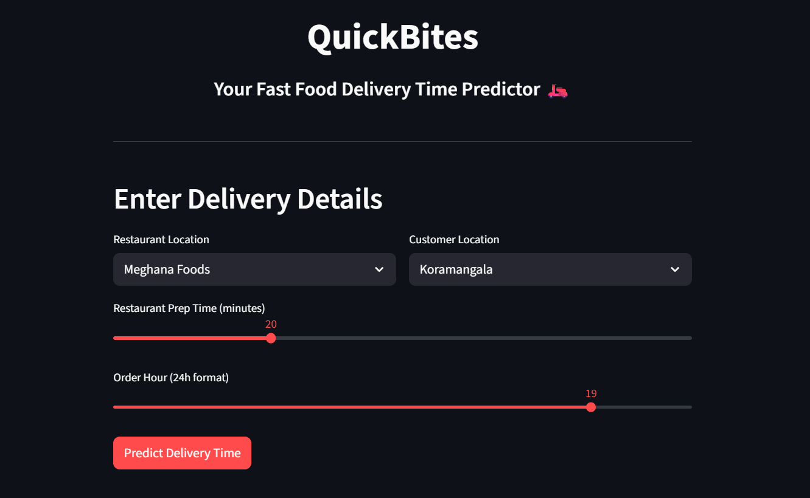

# QuickBites: Food Delivery Time Prediction



**Live Demo:** [https://quickbites.streamlit.app/](https://quickbites.streamlit.app/)

## 🚀 Quick Start

Try the app instantly:
- **Live Demo:** [https://quickbites.streamlit.app/](https://quickbites.streamlit.app/)
- No setup required—just click and use!

## 📝 Project Overview

QuickBites predicts food delivery times in Bengaluru using real-world road distances and travel times from Google Maps. It considers restaurant and customer locations, restaurant type, preparation time, and order hour. Designed for:
- Food delivery enthusiasts
- Data science learners
- Anyone interested in location-based ML applications

The app uses Google Maps Geocoding and Directions APIs, feature engineering, and a Random Forest model to estimate delivery times. You can run it locally or use the live demo above.

## Features
- Geocodes restaurant and customer addresses using Google Maps Geocoding API.
- Calculates real-world road distance and travel time using Google Maps Directions API.
- Simulates customer locations and order data.
- Trains a Random Forest regression model with hyperparameter tuning.
- Provides a Streamlit web app for easy predictions.
- Visualizes delivery route using Google Maps Static API.
- Robust error handling and secure API key management.

## Setup Instructions

1. **Clone the repository:**
   ```sh
   git clone https://github.com/balanivansh/L2-project-QuickBites.git
   cd L2-project-QuickBites
   ```

2. **Create and activate a Python virtual environment:**
   ```sh
   python -m venv l2_project_env
   l2_project_env\Scripts\activate
   ```

3. **Install dependencies:**
   ```sh
   pip install -r requirements.txt
   ```

4. **Set your Google Maps API key:**
   - Obtain an API key from [Google Cloud Console](https://console.cloud.google.com/).
   - Set the environment variable `GOOGLE_MAPS_API_KEY`:
     - **Windows (PowerShell):**
       ```powershell
       $env:GOOGLE_MAPS_API_KEY="your_api_key_here"
       ```
     - **Linux/macOS:**
       ```sh
       export GOOGLE_MAPS_API_KEY="your_api_key_here"
       ```

   - For **Streamlit Cloud**, set the secret in the app dashboard:
     - Go to **Settings > Secrets** and add:
       ```
       GOOGLE_MAPS_API_KEY = your_api_key_here
       ```

5. **Run the data acquisition and model training scripts:**
   ```sh
   python 01_acquire_and_geocode_data.py
   python 02_train_and_save_model.py
   ```

6. **Launch the Streamlit app:**
   ```sh
   streamlit run app.py
   ```

## Model Details

- **Input features:** Restaurant name, customer location, restaurant type, preparation time, order hour, real-world road distance, peak hour indicator.
- **Output:** Estimated delivery time (minutes).
- **Model:** Random Forest Regressor with GridSearchCV for hyperparameter optimization.

## Code Structure

- `01_acquire_and_geocode_data.py`: Loads and geocodes restaurant/customer data using Google Maps API.
- `02_train_and_save_model.py`: Trains and saves the delivery time prediction model.
- `app.py`: Streamlit UI for predictions, route visualization, and robust error handling.

## Security & Best Practices

- **API Key Management:** Never hardcode your API key. Always use environment variables or Streamlit secrets.
- **Error Handling:** The app provides clear feedback for API errors and missing files.

## Deployment

- **Streamlit Cloud:**
   - Set your `GOOGLE_MAPS_API_KEY` in the app's Secrets settings.
   - Push your changes to GitHub and redeploy.

## License

MIT License
