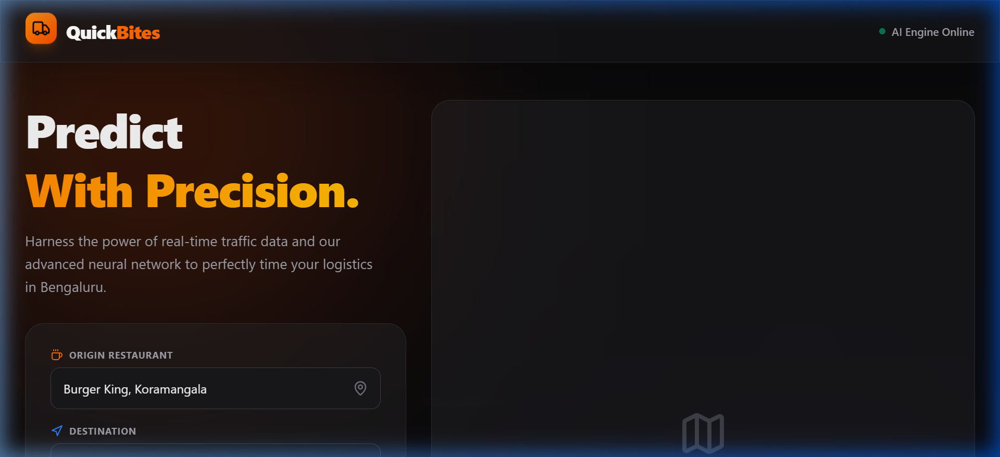
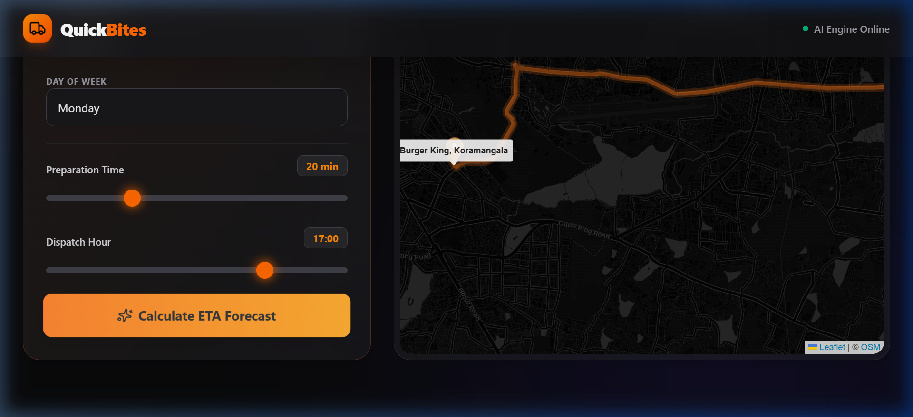

# QuickBites: Food Delivery Time Prediction






**Live Demo:** [https://l2-project-quick-bites.vercel.app/](https://l2-project-quick-bites.vercel.app/)


## 📝 Project Overview
QuickBites is an advanced food delivery time predictor for Bengaluru. This project moves beyond simple estimates by building a machine learning model that provides a holistic "click-to-door" time.

It achieves this by integrating a traffic-forecasted travel time from the Google Maps API with other critical operational factors like restaurant preparation time, location-specific delays, and time of day. The result is a dynamic, end-to-end prediction engine deployed as a fully interactive React and FastAPI full-stack application.

## ✨ Features
- Predictive Traffic Forecasting: Utilizes the Google Maps Directions API to get a travel time estimate based on Google's historical traffic data for a future departure time.

- Advanced ML Model: A Random Forest Regressor that learns the "Operational Friction"—hidden delays in the kitchen and at the customer's doorstep—on top of the API's travel forecast.

- Premium Interactive UI: A glowing, dark-themed React application styled with Tailwind CSS for a seamless user experience.

- Dynamic Map Visualization: An interactive React-Leaflet map that displays the optimal delivery route with custom styling.

- Detailed ETA Breakdown: Transparently shows the user the breakdown of the total time (Food Prep vs. Travel Time).

- Dynamic Fee Calculation: Estimates the delivery fee with a simple surge pricing model for peak hours.

- Decoupled Architecture: A blazing-fast FastAPI Python backend with a decoupled modern Vite + React frontend.

## 🛠️ Setup and Installation
1. **Clone the Repository**
   ```sh
   git clone https://github.com/balanivansh/L2-project-QuickBites.git
   cd L2-project-QuickBites
   ```

2. **Create and activate a Python virtual environment:**
   ```sh
   python -m venv l2_project_env
   l2_project_env\Scripts\activate   # For Windows
   source l2_project_env/bin/activate   # For Linux/macOS
   ```

3. **Install dependencies:**
   ```sh
   pip install -r requirements.txt
   ```

4. **Environment Variables:**
   - Copy the `.env.example` file and rename it to `.env`
   - Paste your Google Maps API key into it:
     ```env
     GOOGLE_MAPS_API_KEY="your_api_key_here"
     ```

5. **Start the FastAPI Backend Server:**
   ```sh
   uvicorn api:app --reload
   ```
   *The AI engine will now be active on `http://127.0.0.1:8000`*

6. **Start the React Frontend:**
   Open a new terminal, navigate to the frontend directory, install dependencies, and start the Vite server:
   ```sh
   cd frontend
   npm install
   npm run dev
   ```
   *The interactive UI will now be active on `http://localhost:5173`*

## 🤖 Model Details
- **Input Features:** Restaurant Name, Customer Location, Restaurant Type, Prep Time, Order Hour, Day of the Week, Road Distance (km), and Traffic-Forecasted Travel Time (min).

- **Output:** Total Estimated Delivery Time (minutes).

- **Model:** Random Forest Regressor with GridSearchCV for hyperparameter optimization.

## 📁 Code Structure
- `01_acquire_and_geocode_data.py`: Gathers and geocodes the base restaurant and customer location data.

- `02_train_and_save_model.py`: Generates a realistic training dataset using traffic forecasts and then trains, evaluates, and saves the final ML model.

- `api.py`: The FastAPI backend application that loads the ML model and processes predictions.

- `frontend/`: The full React/TypeScript project codebase.

## 🚀 Deployment
- The React Frontend is optimally deployed on **Vercel**.
- The Python FastAPI backend is deployed on **Render**.

- For full deployment, securely manage your environment variables (`VITE_API_URL` for Vercel, and `GOOGLE_MAPS_API_KEY` for Render) via their respective online dashboards.

## 📄 License
This project is licensed under the MIT License.
