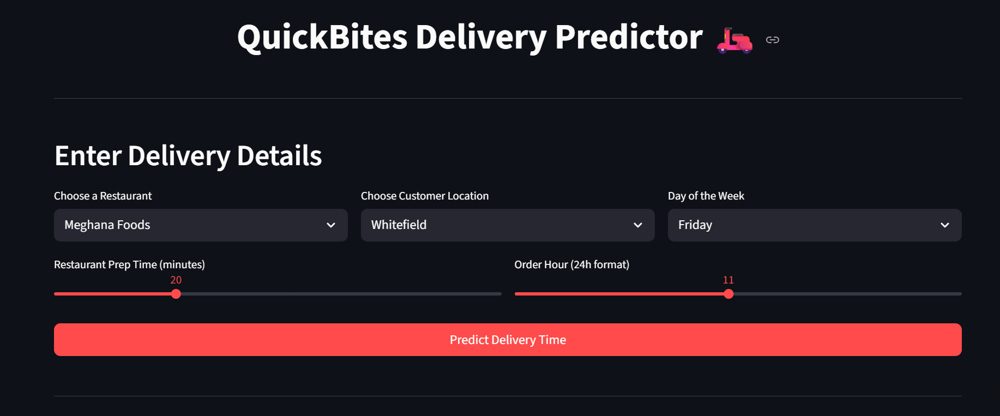

# QuickBites: Food Delivery Time Prediction





**Live Demo:** [https://quickbites.streamlit.app/](https://quickbites.streamlit.app/)


## 📝 Project Overview
QuickBites is an advanced food delivery time predictor for Bengaluru. This project moves beyond simple estimates by building a machine learning model that provides a holistic "click-to-door" time.

It achieves this by integrating a traffic-forecasted travel time from the Google Maps API with other critical operational factors like restaurant preparation time, location-specific delays, and time of day. The result is a dynamic, end-to-end prediction engine deployed as a fully interactive Streamlit web application.

## ✨ Features
- Predictive Traffic Forecasting: Utilizes the Google Maps Directions API to get a travel time estimate based on Google's historical traffic data for a future departure time.

- Advanced ML Model: A Random Forest Regressor that learns the "Operational Friction"—hidden delays in the kitchen and at the customer's doorstep—on top of the API's travel forecast.

- Interactive UI: A polished Streamlit web app for a seamless user experience.

- Dynamic Map Visualization: An interactive Folium map that displays the optimal delivery route.

- Detailed ETA Breakdown: Transparently shows the user the breakdown of the total time (Food Prep vs. Travel Time).

- Dynamic Fee Calculation: Estimates the delivery fee with a simple surge pricing model for peak hours.

- Secure API Key Management: Uses .env files for secure and easy local development and Streamlit Secrets for deployment.

## 🛠️ Setup and Installation
1. **Clone the Repository**
 ```sh

   git clone https://github.com/balanivansh/L2-project-QuickBites.git

   cd L2-project-QuickBites

   ```


2. **Create and activate a Python virtual environment:**

   ```sh

   python -m venv l2_project_env

   l2_project_env\Scripts\activate

   ```


3. **Install dependencies:**

   ```sh

   pip install -r requirements.txt

   ```


4. **Set your Google Maps API key:**

   - Obtain an API key from [Google Cloud Console](https://console.cloud.google.com/).

   - Set the environment variable `GOOGLE_MAPS_API_KEY`:

     - **Windows (PowerShell):**

       ```powershell

       $env:GOOGLE_MAPS_API_KEY="your_api_key_here"

       ```

     - **Linux/macOS:**

       ```sh

       export GOOGLE_MAPS_API_KEY="your_api_key_here"

       ```


   - For **Streamlit Cloud**, set the secret in the app dashboard:

     - Go to **Settings > Secrets** and add:

       ```

       GOOGLE_MAPS_API_KEY = your_api_key_here

       ```
5. **Run the data acquisition and model training scripts:**

   ```sh

   python 01_acquire_and_geocode_data.py

   python 02_train_and_save_model.py

   ```


6. **Launch the Streamlit app:**

   ```sh

   streamlit run app.py

   ```

## 🤖 Model Details
- **Input Features:** Restaurant Name, Customer Location, Restaurant Type, Prep Time, Order Hour, Day of the Week, Road Distance (km), and Traffic-Forecasted Travel Time (min).

- **Output:** Total Estimated Delivery Time (minutes).

- **Model:** Random Forest Regressor with GridSearchCV for hyperparameter optimization.

## 📁 Code Structure
- `01_acquire_and_geocode_data.py`: Gathers and geocodes the base restaurant and customer location data.

- `02_train_and_save_model.py`: Generates a realistic training dataset using traffic forecasts and then trains, evaluates, and saves the final ML model.

- `03_app.py`: The main Streamlit application that loads the model and provides the interactive UI.

## 🚀 Deployment
- This app is deployed on Streamlit Community Cloud.

- For deployment, the Maps_API_KEY is not stored in the .env file but is set securely in the app's Secrets settings on the Streamlit dashboard.

## 📄 License
This project is licensed under the MIT License.
